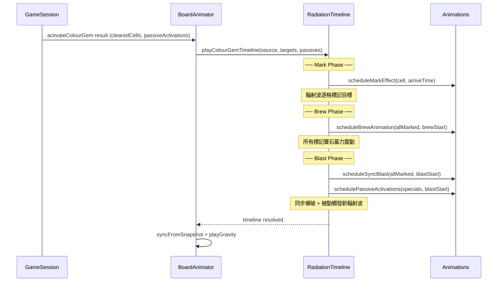

# 設計文件：Color Gem 分階段爆破（Mark → Brew → Blast）

## 概覽

本設計將 Color Gem 的啟動動畫從「輻射波到達即清除」改為三階段序列：

1. **Mark（標記）**：輻射波以 Chebyshev 距離向外擴散，到達目標色寶石時播放標記效果（發光脈衝），而非立即執行 `shrinkCell`。
2. **Brew（蓄力）**：所有目標被標記後，進入短暫蓄力停頓（~400ms），被標記寶石播放震動/亮度遞增動畫，營造爆破前張力。
3. **Blast（爆破）**：蓄力結束後，所有被標記寶石同時執行 `shrinkCell` + 增強粒子效果，產生同步爆炸的視覺衝擊。

此設計**僅修改動畫排程層**（`BoardAnimator`），不改變遊戲邏輯層（`GameSessionController`、`special-gems.ts`）。遊戲邏輯仍然一次性計算所有清除結果，動畫層負責將結果拆分為三階段呈現。

### 設計決策

| 決策 | 選擇 | 理由 |
|------|------|------|
| 修改範圍 | 僅 `board-animator.ts` + 新增動畫工廠 | 保持邏輯/渲染分離，不影響確定性測試 |
| 階段控制 | 擴展現有 `playRadiationTimeline` | 複用已有的 `ScheduledTask` 排程機制 |
| 蓄力時長 | 可配置常數 `BREW_PHASE_DURATION_MS = 400` | 在 300-500ms 範圍內，可透過 design-tokens 調整 |
| 被動觸發時機 | Blast 時刻觸發 | 與邏輯層一致：寶石被清除時才觸發被動效果 |
| 無目標快速路徑 | 跳過 Mark+Brew，僅清除自身 | 避免無意義的等待 |

## 架構



### 與現有系統的關係

```mermaid
graph TD
    subgraph 現有系統
        A[playRadiationTimeline] --> B[scheduleEvent]
        B --> C[shrinkCell at arriveTime]
    end
    
    subgraph 新增：Color Gem 路徑
        D[isColourGemActivation?] -->|yes| E[playColourGemStagedTimeline]
        D -->|no| A
        E --> F[Mark: markCell at arriveTime]
        F --> G[Brew: brewAnimation at markEnd]
        G --> H[Blast: shrinkCell at blastStart]
        H --> I[Passive: scheduleEvent from special pos]
    end
```

## 元件與介面

### 1. 新增常數（`design-tokens.ts`）

```typescript
/** Color Gem 蓄力階段時長（ms） */
export const BREW_PHASE_DURATION_MS = 400;

/** 標記效果脈衝週期（ms） */
export const MARK_PULSE_CYCLE_MS = 300;

/** 標記效果發光透明度範圍 */
export const MARK_GLOW_ALPHA_MIN = 0.4;
export const MARK_GLOW_ALPHA_MAX = 1.0;

/** 蓄力震動振幅（px） */
export const BREW_SHAKE_AMPLITUDE = 2.5;

/** 蓄力亮度遞增最大值 */
export const BREW_BRIGHTNESS_MAX = 1.4;

/** 爆破粒子增強倍率（相對於普通 match clear） */
export const BLAST_PARTICLE_MULTIPLIER = 2.5;
```

### 2. 新增動畫工廠函式（`animations.ts`）

```typescript
/** 標記效果：發光脈衝動畫 */
export interface MarkEffectConfig {
  sprite: GemSprite;
  duration: number;       // 從標記到爆破的持續時間
  colour: number;         // 寶石顏色（用於發光色調）
  reducedMotion: boolean; // 是否使用靜態高亮
}

export function createMarkEffect(config: MarkEffectConfig): Animation;

/** 蓄力動畫：震動 + 亮度遞增 */
export interface BrewAnimationConfig {
  sprite: GemSprite;
  duration: number;  // = BREW_PHASE_DURATION_MS
}

export function createBrewAnimation(config: BrewAnimationConfig): Animation;

/** 增強爆破效果：shrinkCell + 額外粒子 */
export interface EnhancedBlastConfig {
  sprite: GemSprite;
  colour: GemColour | null;
  particleMultiplier: number;
}

export function createEnhancedBlastAnimation(config: EnhancedBlastConfig): Animation;
```

### 3. BoardAnimator 擴展

在 `BoardAnimator` 中新增私有方法：

```typescript
/**
 * Color Gem 專用的分階段輻射時間軸。
 * 
 * 取代原本在 playRadiationTimeline 中對 colour 類型事件的處理，
 * 將「到達即清除」改為「標記 → 蓄力 → 同步爆破」。
 */
private async playColourGemStagedTimeline(
  source: CellPos,
  targets: CellPos[],
  passiveEvents: RadiationEvent[],
  colourByPos: Map<string, GemColour | null>,
  chain: number,
): Promise<void>;
```

### 4. 階段排程邏輯

```typescript
interface StagedTimelinePhases {
  /** Mark phase: 每個目標的到達時間 */
  markSchedule: Array<{ pos: CellPos; arriveAt: number }>;
  /** Mark phase 結束時間 = max(arriveAt) + mark settle buffer */
  markEndTime: number;
  /** Brew phase 開始/結束時間 */
  brewStartTime: number;
  brewEndTime: number;
  /** Blast phase 開始時間 */
  blastStartTime: number;
  /** 被動觸發排程（從 blastStartTime 開始） */
  passiveSchedule: Array<{ event: RadiationEvent; triggerAt: number }>;
}

function computeStagedPhases(
  source: CellPos,
  targets: CellPos[],
  passiveEvents: RadiationEvent[],
): StagedTimelinePhases;
```

### 5. 整合點：攔截 Colour Gem 事件

在 `playRadiationTimeline` 的 `scheduleEvent` 函式中，當偵測到事件類型為 `'colour'` 時，改為呼叫 `playColourGemStagedTimeline`：

```typescript
// 在 scheduleEvent 內部
if (event.type === 'colour') {
  // 委派給分階段時間軸
  await this.playColourGemStagedTimeline(
    event.pos, event.clearedCells, passiveEvents, colourByPos, chain
  );
  return; // 不走原本的逐格 shrinkCell 路徑
}
```

### 6. Combo 整合

對於 `colour.line`、`colour.bomb`、`colour.colour` 組合：

- **colour.line / colour.bomb**：Mark Phase 標記所有同色寶石 → Brew → Blast 時將目標轉換為對應特殊寶石並觸發各自的輻射波
- **colour.colour**：Mark Phase 標記全棋盤 → Brew → Blast 全盤同步清除

這些路徑在 `animateSwap` 的 combo 分支中，透過檢查 `initialActivation.type === 'combo'` 且 combo 涉及 colour gem 時，呼叫對應的分階段時間軸。

## 資料模型

### 標記狀態追蹤

不需要持久化的資料模型變更。標記狀態完全由動畫排程的 `ScheduledTask[]` 陣列管理：

```typescript
// 標記階段的任務
{ time: arriveAt, fn: () => this.markCell(pos, colour) }

// 蓄力階段的任務
{ time: brewStart, fn: () => this.startBrewEffect(markedCells) }

// 爆破階段的任務
{ time: blastStart, fn: () => this.blastAllMarked(markedCells, colourByPos, chain) }
```

### 時序計算公式

```
markArriveAt(cell) = chebyshev(source, cell) × CELL_RADIATION_SPEED_MS
markEndTime = max(markArriveAt(all targets))
brewStartTime = markEndTime
brewEndTime = brewStartTime + BREW_PHASE_DURATION_MS
blastStartTime = brewEndTime
timelineEndTime = blastStartTime + MATCH_CLEAR_DURATION_MS + TIMELINE_TAIL_GRACE_MS
```

### 無目標快速路徑

```typescript
if (targets.length === 0) {
  // 僅清除 Color Gem 自身，跳過 Mark + Brew
  this.shrinkCell(source, null, chain);
  return;
}
```

## 正確性屬性

*正確性屬性是一種在系統所有有效執行中都應成立的特徵或行為——本質上是對系統應做之事的形式化陳述。屬性作為人類可讀規格與機器可驗證正確性保證之間的橋樑。*

### Property 1: 輻射到達時間正確性

*For any* Color Gem 位置 `source` 和任意目標寶石位置 `target`，該目標的標記到達時間應等於 `chebyshev(source, target) × CELL_RADIATION_SPEED_MS`，其中 chebyshev 距離 = max(|source.col - target.col|, |source.row - target.row|)。

**Validates: Requirements 1.1, 1.4**

### Property 2: 標記選擇性

*For any* 棋盤狀態與 Color Gem 啟動事件，輻射波應僅對目標顏色的寶石施加標記效果；對於非目標顏色的寶石，不應產生任何標記任務。即：被標記的格子集合應恰好等於棋盤上所有與目標顏色相同的寶石位置集合。

**Validates: Requirements 1.2, 1.3**

### Property 3: 階段轉換時序

*For any* 目標寶石集合，Mark Phase 結束時間應等於所有目標中最大 Chebyshev 距離 × CELL_RADIATION_SPEED_MS；Brew Phase 應在 Mark Phase 結束時立即開始；Blast Phase 應在 Brew Phase 結束時（= markEnd + BREW_PHASE_DURATION_MS）立即開始。三個階段之間不應有間隙或重疊。

**Validates: Requirements 1.5, 3.1, 3.4**

### Property 4: 爆破同步性

*For any* 被標記的目標寶石集合，所有目標的清除動畫（shrinkCell）應在同一時刻（blastStartTime）被排程執行。不應有任何目標在 blastStartTime 之前或之後被清除。

**Validates: Requirements 4.1**

### Property 5: 標記動畫持續性

*For any* 被標記的目標寶石，其標記視覺效果的持續時間應從該寶石的 `markArriveAt` 時刻開始，持續到 `blastStartTime` 時刻結束。即持續時間 = (markEndTime - markArriveAt) + BREW_PHASE_DURATION_MS。

**Validates: Requirements 2.2**

### Property 6: 被動觸發在爆破時刻啟動

*For any* 棋盤狀態中目標色寶石帶有 Line Bomb 或 Area Bomb 特殊屬性的情況，該特殊寶石的被動啟動輻射波應從 `blastStartTime` 時刻開始，以該寶石位置為中心向外擴散。

**Validates: Requirements 5.1, 5.2**

### Property 7: 清除集合等價性

*For any* 棋盤狀態，分階段爆破流程最終清除的格子集合應與現有立即清除路徑（`activateColourGem` + `processSpecialActivations`）產生的清除集合完全相同。動畫分階段不應改變遊戲邏輯結果。

**Validates: Requirements 5.3**

### Property 8: 總時長上界

*For any* 棋盤狀態，完整三階段序列的總時長應不超過：現有 Color Gem 輻射時間軸時長 + BREW_PHASE_DURATION_MS。即分階段設計僅增加固定的蓄力時長，不應引入額外的非預期延遲。

**Validates: Requirements 6.1**

### Property 9: 被動觸發時長折扣

*For any* 在連鎖中被動觸發的特殊寶石，其啟動動畫時長應等於基礎時長 × PASSIVE_ACTIVATION_DURATION_SCALE（0.7）。

**Validates: Requirements 6.3**

### Property 10: Combo 標記階段覆蓋

*For any* colour.line 或 colour.bomb 組合啟動，Mark Phase 標記的寶石集合應等於棋盤上所有與目標顏色相同的寶石位置集合（不含組合的兩顆寶石自身）。標記應在轉換為對應特殊寶石之前完成。

**Validates: Requirements 7.1, 7.2**

### Property 11: colour.colour 全盤標記

*For any* colour.colour 組合啟動，Mark Phase 標記的寶石集合應等於棋盤上所有非空格子的位置集合。

**Validates: Requirements 7.3**

## 錯誤處理

| 情境 | 處理方式 |
|------|----------|
| 目標集合為空（棋盤無同色寶石） | 跳過 Mark + Brew，僅清除 Color Gem 自身並立即 resolve |
| Sprite 在動畫中途被銷毀（board sync） | 動畫 `update()` 檢查 `sprite.scale` 是否存在，若不存在則提前結束（與現有 `createMatchClearAnimation` 一致） |
| 標記動畫超時（stall） | 複用現有 `STALL_TIMEOUT_MS`（10s）保護機制 |
| 被動觸發產生無限迴圈 | 複用現有 `processSpecialActivations` 的 `processed` Set 去重機制 |
| 減少動態模式啟用 | Mark Phase 使用靜態邊框高亮取代脈衝動畫；Brew Phase 使用亮度變化取代震動 |

## 測試策略

### 屬性測試（Property-Based Testing）

使用 **fast-check** 作為屬性測試框架。每個屬性測試至少執行 100 次迭代。

測試標記格式：`Feature: color-gem-staged-blast, Property {number}: {property_text}`

**測試重點：**
- `computeStagedPhases` 純函式的時序計算正確性（Properties 1, 3, 4, 5, 8）
- 標記選擇性邏輯（Property 2）
- 清除集合等價性（Property 7）— 對比分階段排程與直接呼叫 `activateColourGem` 的結果
- 被動觸發時序（Properties 6, 9）
- Combo 路徑的標記集合（Properties 10, 11）

### 單元測試（Example-Based）

- 標記效果動畫工廠回傳正確的 Animation 物件
- 蓄力動畫的震動振幅與亮度遞增行為
- 減少動態模式下的替代效果
- 分數彈出在 Blast 完成後顯示
- 無目標快速路徑正確跳過 Mark + Brew
- `BREW_PHASE_DURATION_MS` 在 300-500ms 範圍內

### 整合測試

- 完整的 swap → colour gem activation → staged blast → gravity → cascade 流程
- colour.line / colour.bomb / colour.colour combo 路徑的端到端動畫序列
- 效能基準：60 FPS 下每幀 < 25ms（大棋盤 + 多目標場景）

### 測試配置

```typescript
// fast-check 配置
fc.assert(
  fc.property(arbBoard, arbColourGemPos, (board, source) => {
    // property assertion
  }),
  { numRuns: 100 }
);
```
