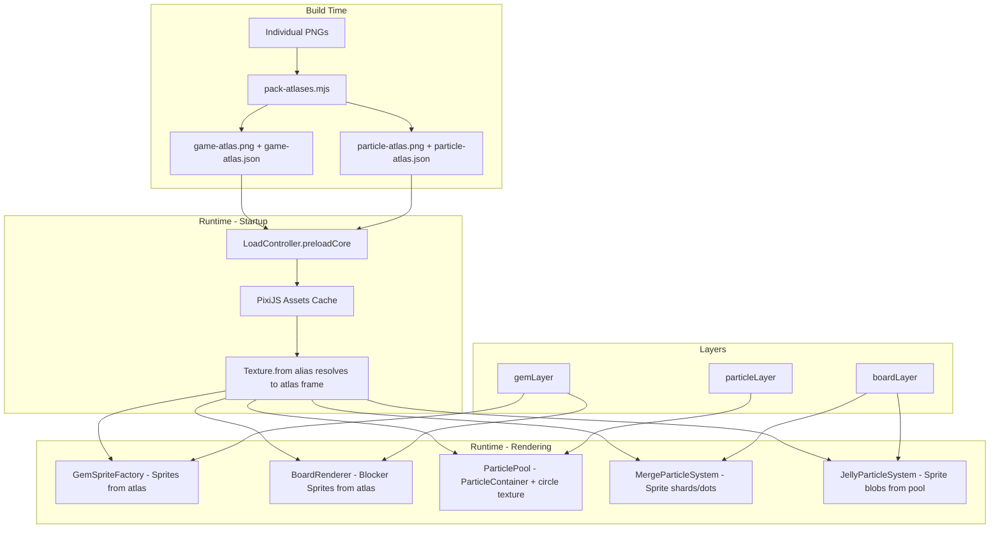
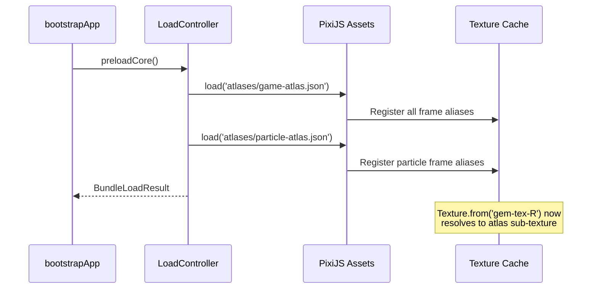
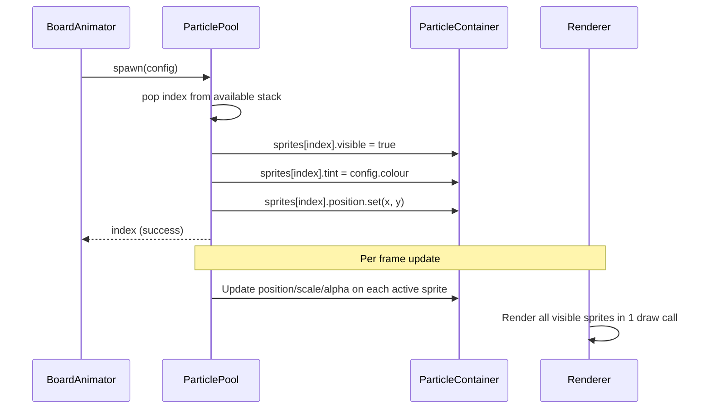
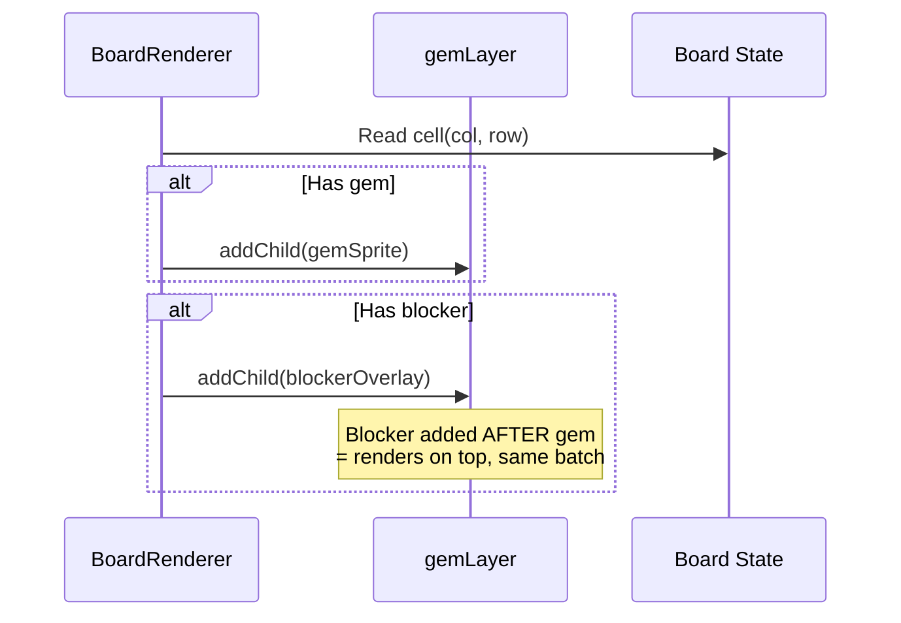

# Design Document: Draw Call Optimization

## Overview

This design reduces draw calls in the PixiJS 8 match-3 game from ~267 (peak 300+) to a budget of 3–5 static / 8–12 during cascades. The approach has four pillars:

1. **Texture Atlas** — Pack all PNGs into 1–2 atlases at build time so the renderer never switches texture bindings within a layer.
2. **Particle Sprite Conversion** — Replace per-particle `Graphics.circle()` redraws with tinted `Sprite` instances inside a `ParticleContainer`, collapsing hundreds of draw calls to 1–2.
3. **Layer Consolidation** — Move blocker overlays into `gemLayer` so blockers and gems batch together.
4. **Object Pooling** — Pool temporary `Graphics` objects (blast zones, marks, hints) to eliminate per-frame allocation.

All changes preserve existing public APIs and visual fidelity.

## Architecture



### Draw Call Budget Breakdown

| State | Layer | Draw Calls | Reason |
|-------|-------|-----------|--------|
| Idle | Background | 1 | Single world texture |
| Idle | gemLayer (gems + blockers) | 1 | All share game-atlas |
| Idle | HUD | 1–2 | UI sprites from atlas |
| Idle | **Total** | **3–4** | |
| Cascade | + particleLayer (ParticleContainer) | 1 | Single circle texture |
| Cascade | + merge-fx (shards + dots) | 2 | Diamond tex + circle tex |
| Cascade | + jelly-fx | 1 | Blob texture |
| Cascade | + blast zone Graphics | 1–2 | Temporary overlays |
| Cascade | + score popups | 1–2 | Text objects |
| Cascade | **Total** | **8–12** | |

## Components and Interfaces

### 1. Atlas Builder (`build-tools/pack-atlases.mjs`)

Replaces the current manifest-only stub with actual texture packing using `free-tex-packer-core`.

```typescript
// Output structure
interface AtlasOutput {
  /** Atlas image file (PNG) */
  imagePath: string;
  /** PixiJS-compatible spritesheet JSON */
  jsonPath: string;
  /** Frame count packed into this atlas */
  frameCount: number;
}

interface PackResult {
  atlases: AtlasOutput[];
  errors: string[];  // e.g. oversized assets
}
```

**Packing strategy:**
- Atlas 1 (`game-atlas`): gems, blockers, items, UI — all gameplay sprites
- Atlas 2 (`particle-atlas`): pre-rendered particle shapes (circle, diamond, blob) — kept separate because particles use `ParticleContainer` with additive blending

**Build integration:** The `pack-atlases` script runs before `vite build`. Output goes to `public/assets/atlases/`.

### 2. Pre-rendered Particle Textures

Generated at application startup via `renderer.generateTexture()` and added to the particle atlas at build time as fallback PNGs.

```typescript
interface ParticleTextures {
  /** 16×16 white filled circle (tinted per-particle) */
  circle: Texture;
  /** 16×16 white diamond/rhombus shape */
  diamond: Texture;
  /** 16×16 white blob with inner highlight */
  blob: Texture;
}

/** Called once during app init, after atlas load */
function generateParticleTextures(renderer: Renderer): ParticleTextures;
```

The textures are white so that `Sprite.tint` produces the desired colour without texture rebinding.

### 3. LoadController Changes

```typescript
// New method on LoadController
async preloadCore(onProgress?: ProgressCallback): Promise<BundleLoadResult> {
  // 1. Load spritesheet JSONs (which auto-load backing atlas PNGs)
  //    Assets.load('assets/atlases/game-atlas.json')
  //    Assets.load('assets/atlases/particle-atlas.json')
  // 2. All frame aliases registered in Assets cache automatically
  // 3. Fallback: if atlas load fails, load individual PNGs (existing behavior)
}
```

### 4. ParticlePool Refactor

```typescript
// Before: each Particle owns a Graphics that redraws circle on init
// After:  ParticlePool owns a ParticleContainer; each particle is a Sprite

class ParticlePool {
  private readonly particleContainer: ParticleContainer;
  private readonly sprites: Sprite[];       // pre-allocated
  private readonly activeIndices: number[];  // indices of active sprites
  private readonly pool: number[];           // indices of available sprites

  spawn(config: ParticleConfig): number | null;  // returns index or null
  update(dtMs: number): void;
  clear(): void;
  destroy(): void;

  get activeCount(): number;
  get availableCount(): number;
  get capacity(): number;
}
```

**Key changes:**
- `ParticleContainer` replaces the plain `Container` — enables GPU-instanced rendering
- Each particle is a pre-created `Sprite` with the circle texture, toggled via `visible`
- Colour is applied via `sprite.tint = config.colour` (no redraw)
- Position/scale/alpha updated per-frame on the Sprite directly

### 5. MergeParticleSystem Refactor

```typescript
class MergeParticleSystem {
  // Pools now hold Sprites instead of Graphics for shards and dots
  private shardPool: Sprite[];   // diamond texture, tinted
  private dotPool: Sprite[];     // circle texture, tinted
  private ringPool: Sprite[];    // ring texture (unchanged — already Sprite)

  // Acquire/release unchanged in API, but internal type changes
  private acquireShard(colour: number): Sprite;
  private releaseShard(s: Sprite): void;
  private acquireDot(colour: number): Sprite;
  private releaseDot(s: Sprite): void;
}
```

**Shard conversion:** Replace `Graphics.moveTo/lineTo/fill` with a pre-rendered diamond `Sprite`. Rotation and scale still animate per-frame.

**Dot conversion:** Replace `Graphics.circle/fill` with the same circle `Sprite` used by `ParticlePool`.

### 6. JellyParticleSystem Refactor

```typescript
class JellyParticleSystem {
  private readonly pool: Sprite[];        // pre-allocated blob Sprites
  private readonly available: number[];   // indices of free sprites
  private readonly active: JellyBlob[];   // active particle state
  private readonly container: Container;
  private readonly poolCap: number;       // default 48

  spawn(x: number, y: number, cleared: boolean): void;
  update(dtMs: number): void;
  destroy(): void;
}

interface JellyBlob {
  spriteIndex: number;  // index into pool
  vx: number;
  vy: number;
  life: number;
  maxLife: number;
}
```

**Key changes:**
- Pre-allocate 48 `Sprite` objects with blob texture at construction
- `spawn()` acquires from pool, sets tint/position/scale
- `update()` animates position/alpha/scale; returns to pool on death
- No `Graphics` creation or destruction during gameplay

### 7. Blocker Layer Merge

```typescript
// BoardRenderer changes:
// Before: this.layers.glowLayer.addChild(overlay)
// After:  this.layers.gemLayer.addChild(overlay)

// Z-ordering strategy:
// For each cell (col, row):
//   1. Add gem sprite to gemLayer
//   2. Add blocker overlay to gemLayer (after gem → renders on top)
// This preserves visual layering while enabling batching.
```

The `glowLayer` remains for selection glow effects (which use alpha blending and don't need atlas textures).

### 8. Graphics Object Pool

```typescript
class GraphicsPool {
  private readonly pool: Graphics[];
  private readonly capacity: number;

  constructor(parentContainer: Container, capacity?: number);

  /** Acquire a cleared, visible Graphics from the pool */
  acquire(): Graphics;

  /** Return a Graphics to the pool (clears and hides it) */
  release(g: Graphics): void;

  /** Current available count */
  get available(): number;

  destroy(): void;
}
```

Used by `BoardAnimator` for:
- Blast zone overlays (`createBlastZoneOverlay`)
- Mark effect highlights (`createMarkEffect`)
- Hint flash rectangles (`showHintFlash`)

Overflow strategy: if pool is exhausted, create a new `Graphics` (not pooled) and `destroy()` it on completion.

### 9. Draw Call Stats Integration

```typescript
// Extension to existing StatsPanel
interface DrawCallStats {
  /** Current frame draw call count */
  drawCalls: number;
  /** Whether current frame exceeds budget */
  overBudget: boolean;
}

// Read from renderer.renderPipes.batch.drawCount (PixiJS 8 internal)
function getDrawCallCount(renderer: Renderer): number;
```

Displayed in the existing Tweakpane debug panel alongside FPS.

## Data Models

### Atlas Spritesheet JSON (PixiJS format)

```json
{
  "frames": {
    "gem-tex-R": {
      "frame": { "x": 0, "y": 0, "w": 128, "h": 128 },
      "sourceSize": { "w": 128, "h": 128 },
      "spriteSourceSize": { "x": 0, "y": 0, "w": 128, "h": 128 }
    },
    "blocker-stone": {
      "frame": { "x": 128, "y": 0, "w": 128, "h": 128 },
      "sourceSize": { "w": 128, "h": 128 },
      "spriteSourceSize": { "x": 0, "y": 0, "w": 128, "h": 128 }
    }
  },
  "meta": {
    "image": "game-atlas.png",
    "size": { "w": 2048, "h": 1024 },
    "scale": 1
  }
}
```

### ParticleConfig (unchanged public interface)

```typescript
interface ParticleConfig {
  x: number;
  y: number;
  vx: number;
  vy: number;
  lifetime: number;
  radius: number;
  colour: number;
  alpha: number;
  gravity?: number;
  shrink?: boolean;
}
```

Internally, `radius` maps to `sprite.scale` relative to the base texture size (16px). `colour` maps to `sprite.tint`.

### GraphicsPool State

```typescript
// Internal tracking — no public data model needed
// Pool is a simple stack (LIFO) of pre-allocated Graphics objects
```

## Sequence Diagrams

### Atlas Load Sequence



### Particle Spawn Sequence (After Refactor)



### Blocker Sync Sequence (After Layer Merge)



## Correctness Properties

*A property is a characteristic or behavior that should hold true across all valid executions of a system — essentially, a formal statement about what the system should do. Properties serve as the bridge between human-readable specifications and machine-verifiable correctness guarantees.*

### Property 1: Atlas packing correctness

*For any* set of input images where each individual image is ≤ 4096×4096, the atlas packer SHALL produce at most 2 atlas files each ≤ 4096×4096, and the output spritesheet JSON SHALL contain a frame entry for every input image with coordinates that fall within the atlas bounds and alias names matching the original input aliases exactly.

**Validates: Requirements 1.1, 1.2, 1.3**

### Property 2: Particle sprite properties match config

*For any* valid `ParticleConfig` (with colour, position, radius, alpha), after spawning a particle, the corresponding Sprite SHALL have `tint` equal to the config colour, `position` equal to (config.x, config.y), `scale` proportional to config.radius / baseTextureSize, and `alpha` equal to config.alpha.

**Validates: Requirements 3.3, 3.4**

### Property 3: MergeParticleSystem pool bounded

*For any* sequence of spawn and update calls on MergeParticleSystem, the total number of pooled + active shard Sprites SHALL never exceed POOL_CAP (128), and the total number of pooled + active dot Sprites SHALL never exceed POOL_CAP (128).

**Validates: Requirements 4.4**

### Property 4: MergeParticleSystem release resets state

*For any* shard or dot Sprite that is released back to the pool (after its life reaches 0), the Sprite SHALL have `visible = false`, `alpha = 1`, `scale.x = 1`, `scale.y = 1`, `rotation = 0`, `tint = 0xFFFFFF`, and SHALL NOT be destroyed.

**Validates: Requirements 4.5**

### Property 5: Jelly pool lifecycle

*For any* sequence of spawn and update calls on JellyParticleSystem, spawning N blobs SHALL decrease available pool count by N (clamped to 0), and when a blob's lifetime expires during update, available pool count SHALL increase by 1 and the Sprite SHALL have `visible = false`.

**Validates: Requirements 5.2, 5.4**

### Property 6: Blocker z-ordering invariant

*For any* board configuration where a cell has both a gem and a blocker, after BoardRenderer.sync(), the blocker overlay's child index in gemLayer SHALL be greater than the gem Sprite's child index for the same cell.

**Validates: Requirements 6.3**

### Property 7: Blocker removal isolation

*For any* board state transition where a blocker is removed from a cell that also contains a gem, after BoardRenderer.sync(), the gem Sprite at that position SHALL remain present and unchanged in gemLayer.

**Validates: Requirements 6.4**

### Property 8: Graphics pool lifecycle

*For any* sequence of acquire and release operations on GraphicsPool, releasing a Graphics object SHALL result in `visible = false` and an empty graphics context (no drawn paths), the object SHALL NOT be destroyed, and the available count SHALL increase by 1.

**Validates: Requirements 7.2, 7.3**

## Error Handling

| Scenario | Handling |
|----------|----------|
| Atlas spritesheet fails to load | `LoadController` falls back to individual PNG loading; logs warning. Game still playable with higher draw calls. |
| Individual PNG exceeds 4096×4096 | Build-time error from `pack-atlases.mjs` — CI fails with clear message identifying the asset. |
| ParticlePool at capacity | `spawn()` returns `null`; caller skips particle (existing behavior preserved). |
| JellyParticleSystem pool exhausted | `spawn()` silently skips additional blobs (graceful degradation — fewer particles, no crash). |
| GraphicsPool exhausted during cascade | Creates overflow `Graphics` object; destroys it on effect completion. Logged as debug warning. |
| `renderer.generateTexture()` fails | Falls back to atlas-packed PNG versions of particle shapes. |
| Draw call budget exceeded | Debug stats panel shows warning indicator; no runtime impact (informational only). |

## Testing Strategy

### Property-Based Tests (fast-check)

Each correctness property maps to a property-based test with minimum 100 iterations:

- **Property 1** — Generate random image dimension sets, run packing algorithm, verify atlas constraints and JSON completeness.
- **Property 2** — Generate random `ParticleConfig` values, spawn into pool, assert Sprite properties match.
- **Property 3** — Generate random spawn/update sequences, assert pool invariant holds.
- **Property 4** — Generate random particle end-states, trigger release, assert reset state.
- **Property 5** — Generate random jelly spawn/update sequences, assert pool count invariants.
- **Property 6** — Generate random board layouts with blockers, sync, assert child index ordering.
- **Property 7** — Generate board transitions with blocker removal, assert gem preservation.
- **Property 8** — Generate acquire/release sequences, assert pool state invariants.

**Configuration:**
- Library: `fast-check` (already in devDependencies)
- Iterations: 100 minimum per property
- Tag format: `Feature: draw-call-optimization, Property N: <title>`

### Unit Tests (vitest)

- Atlas builder: oversized image error (edge case 1.4)
- LoadController: fallback on spritesheet load failure (edge case 2.5)
- ParticlePool: returns null at capacity (edge case 3.5)
- JellyParticleSystem: skips spawn when exhausted (edge case 5.5)
- GraphicsPool: overflow creates non-pooled object (edge case 7.5)
- BoardRenderer: blocker in gemLayer (example 6.1)
- Stats panel: draw call count display (example 8.3)
- Stats panel: over-budget warning (example 8.4)

### Integration Tests

- Full board render produces ≤ 5 draw calls in idle (8.1)
- Peak cascade produces ≤ 12 draw calls (8.2)
- Atlas-loaded textures resolve via `Texture.from(alias)` (1.5, 2.2)
- ParticleContainer batches all particles into 1 draw call (3.2)

### Visual Regression

- Screenshot comparison of particle effects before/after conversion (manual verification that visual fidelity is preserved)
