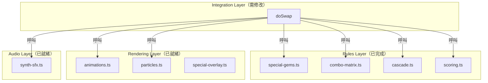
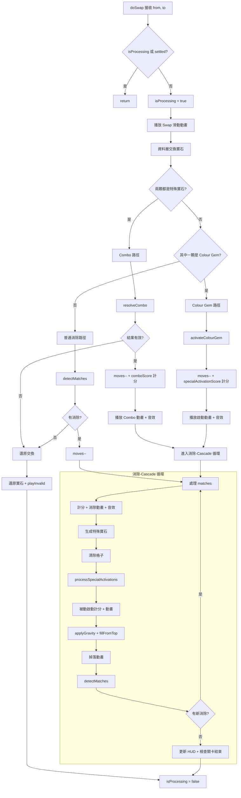

# 技術設計文件：特殊寶石啟動效果

## 概覽

本設計描述如何將規則層已完成的特殊寶石啟動邏輯整合至 `game-integration.ts` 的 `doSwap` 函式。目前 `doSwap` 僅處理普通消除流程，不偵測特殊寶石交換（Colour Gem、Combo）也不呼叫 `processSpecialActivations`。本設計的核心目標是在 `doSwap` 中加入三條分支路徑（Combo → Colour Gem → 普通消除），並在每次消除步驟後呼叫被動啟動處理，同時整合計分、動畫與音效。

### 設計目標

1. **最小侵入**：盡量複用現有規則層函式（`resolveCombo`、`activateColourGem`、`processSpecialActivations`、`specialActivationScore`、`comboScore`），不重複實作邏輯
2. **確定性**：所有啟動順序由 `sortActivationOrder` 保證，確保相同輸入產生相同結果
3. **動畫與邏輯分離**：資料層先完成所有清除計算，再批次播放動畫，避免動畫影響遊戲狀態

## 架構

### 現有架構概覽



### 修改後的 doSwap 流程



## 元件與介面

### 需要匯入的模組

`doSwap` 需要額外匯入以下已存在的函式：

```typescript
// 規則層
import { resolveCombo } from '../game/rules/combo-matrix';
import { activateColourGem, processSpecialActivations } from '../game/rules/special-gems';
import { specialActivationScore, comboScore } from '../game/rules/scoring';

// 渲染層
import { createSpecialActivationEffect } from '../rendering/animations';

// 音效層（已匯入 playMatchSfx，需額外使用）
// combo 音效使用 play('combo') 或新增 playCombo 函式
```

### doSwap 內部分支偵測邏輯

交換後（資料層已交換），依以下優先順序偵測：

```typescript
// 偵測順序：Combo → Colour Gem → 普通消除
function detectSwapType(
  cellFrom: Cell, cellTo: Cell
): 'combo' | 'colourGem' | 'normal' {
  // 1. 兩顆都有 special → Combo
  if (cellFrom.gem?.special && cellTo.gem?.special) {
    return 'combo';
  }
  // 2. 其中一顆是 Colour Gem，另一顆是普通寶石
  if (
    (cellFrom.gem?.special === 'colour' && cellTo.gem?.colour !== null) ||
    (cellTo.gem?.special === 'colour' && cellFrom.gem?.colour !== null)
  ) {
    return 'colourGem';
  }
  // 3. 普通消除
  return 'normal';
}
```

### Combo 路徑

```typescript
// Combo 路徑（兩顆特殊寶石交換）
const comboResult = resolveCombo(board, from, to);
if (!comboResult || comboResult.clearedCells.length === 0) {
  // 無效 → 還原
  revertSwap();
  return;
}

// 有效 Combo
rulesEngine.movesRemaining--;
const comboType = getComboType(cellFrom.gem!.special!, cellTo.gem!.special!);
const comboPoints = comboScore(comboType, chain);
rulesEngine.score += comboPoints;

// 播放 Combo 動畫 + 音效
playComboSfx();
await playComboAnimation(comboResult, comboType, comboPoints);

// 被動啟動處理
const passiveResult = processSpecialActivations(board, comboResult.clearedCells);
await playPassiveActivations(passiveResult, chain);

// 進入 cascade 循環
await runCascadeLoop();
```

### Colour Gem 路徑

```typescript
// Colour Gem 路徑
const [colourGemPos, normalPos] = identifyColourGemSwap(from, to, cellFrom, cellTo);
const targetColour = getCell(board, normalPos)!.gem!.colour!;

rulesEngine.movesRemaining--;

const colourResult = activateColourGem(board, colourGemPos, targetColour);
const activationPoints = specialActivationScore(
  colourResult.clearedCells.length, chain, true /* isColour */
);
rulesEngine.score += activationPoints;

// 播放啟動動畫 + 音效
await playActivationAnimation(colourGemPos, colourResult);
playMatchSfx(colourResult.clearedCells.length, chain);

// 被動啟動處理
const passiveResult = processSpecialActivations(board, colourResult.clearedCells);
await playPassiveActivations(passiveResult, chain);

// 進入 cascade 循環
await runCascadeLoop();
```

### 普通消除路徑（增強版）

在現有的消除-cascade 循環中，於清除格子後加入 `processSpecialActivations` 呼叫：

```typescript
// 在清除 matched cells 之後
const specialResult = processSpecialActivations(board, clearedCells);

if (specialResult.triggeredSpecials.length > 0) {
  // 計算被動啟動分數
  const activationPoints = specialActivationScore(
    specialResult.clearedCells.length - clearedCells.length, // 額外清除的格子
    chain,
    false
  );
  rulesEngine.score += activationPoints;

  // 播放被動啟動動畫
  await playPassiveActivations(specialResult, chain);

  // 合併額外清除的格子
  mergeClearedCells(clearedCells, specialResult.clearedCells);
}
```

### 輔助函式

#### identifyColourGemSwap

```typescript
function identifyColourGemSwap(
  from: CellPos, to: CellPos,
  cellFrom: Cell, cellTo: Cell
): [colourGemPos: CellPos, normalPos: CellPos] {
  if (cellFrom.gem?.special === 'colour') return [from, to];
  return [to, from];
}
```

#### playPassiveActivations

```typescript
async function playPassiveActivations(
  result: ClearResult, chain: number
): Promise<void> {
  for (const pos of result.triggeredSpecials) {
    const [c, r] = pos;
    const x = c * CELL_SIZE + CELL_SIZE / 2;
    const y = r * CELL_SIZE + CELL_SIZE / 2;

    // 播放啟動效果
    const anim = createSpecialActivationEffect(x, y, colour, fxLayer);
    playMatchSfx(/* count based on cleared */, chain);

    // 不需要 await 每個動畫完成，可以疊加播放
    animManager.add(anim);
  }
  // 等待所有啟動動畫完成
  await waitForAnimations();
}
```

#### playComboSfx

在 `synth-sfx.ts` 中新增或複用現有的 combo 音效：

```typescript
export function playCombo(): void {
  play('combo', 0.7, 1.0);
}
```

`combo.wav` 已存在於 `public/assets/sfx/combo.wav`，只需在 `SFX_FILES` 中註冊並新增 `playCombo` 匯出函式。

## 資料模型

### 現有資料結構（無需修改）

本功能不需要新增資料模型。所有必要的型別已定義：

| 型別 | 位置 | 用途 |
|------|------|------|
| `ClearResult` | `special-gems.ts` | 啟動結果（clearedCells + triggeredSpecials） |
| `ComboType` | `types/index.ts` | 6 種 Combo 類型字串聯集 |
| `SpecialGemType` | `types/index.ts` | 4 種特殊寶石類型 |
| `Board`, `Cell`, `Gem` | `board.ts` | 棋盤、格子、寶石資料結構 |

### 計分公式參照

| 啟動類型 | 公式 | 函式 |
|----------|------|------|
| Line/Area Bomb | `60 × N × multiplier(chain)` | `specialActivationScore(N, chain, false)` |
| Colour Gem | `(60 × N + 500) × multiplier(chain)` | `specialActivationScore(N, chain, true)` |
| Combo | `COMBO_BASE[type] × multiplier(chain)` | `comboScore(type, chain)` |

其中 `multiplier(chain) = min(1.0 + (chain - 1) × 0.5, 4.0)`。

### 手數扣除規則

| 場景 | 扣手數 | 時機 |
|------|--------|------|
| 有效普通交換 | 是（1 次） | 偵測到 match 後立即扣除 |
| Colour Gem 交換 | 是（1 次） | 呼叫 activateColourGem 前扣除 |
| Combo 交換 | 是（1 次） | 呼叫 resolveCombo 確認有效後扣除 |
| 無效交換 | 否 | — |
| Cascade 被動啟動 | 否 | — |

## 正確性屬性

*正確性屬性（Correctness Property）是一種在系統所有合法執行中都應成立的特徵或行為——本質上是對系統應做之事的形式化陳述。屬性是人類可讀規格與機器可驗證正確性保證之間的橋樑。*

### Property 1：被動啟動整合

*For any* 棋盤狀態，當一組格子被清除後，若清除區域的鄰居中存在 Line Bomb 或 Area Bomb，則呼叫 `processSpecialActivations` 後回傳的 `clearedCells` 應包含所有被連鎖引爆的格子，且這些格子應全部被納入後續的 cascade 流程。

**Validates: Requirements 1.1, 1.3, 1.4, 1.5**

### Property 2：Colour Gem 交換偵測與啟動

*For any* 棋盤狀態，當一顆 Colour Gem 與一顆具有非 null 顏色的普通寶石相鄰並被交換時，`activateColourGem` 應以該普通寶石的顏色作為 `targetColour` 被呼叫，且棋盤上所有該顏色的寶石應被清除。

**Validates: Requirements 2.1, 2.2**

### Property 3：Combo 交換偵測與 Cascade

*For any* 棋盤狀態，當兩顆皆具有 `special` 屬性的寶石相鄰並被交換時，`resolveCombo` 應被呼叫，若回傳有效的 `ClearResult`（`clearedCells.length > 0`），則清除結果應被納入後續的 cascade 流程。

**Validates: Requirements 3.1, 3.2, 3.5**

### Property 4：特殊寶石啟動計分公式

*For any* 正整數 N（清除格數）和正整數 chain（連鎖數），Line/Area Bomb 的啟動分數應等於 `Math.round(60 × N × min(1.0 + (chain - 1) × 0.5, 4.0))`，Colour Gem 的啟動分數應等於 `Math.round((60 × N + 500) × min(1.0 + (chain - 1) × 0.5, 4.0))`。

**Validates: Requirements 4.1, 4.2**

### Property 5：Combo 計分公式

*For any* ComboType 和正整數 chain，Combo 分數應等於 `Math.round(COMBO_BASE[type] × min(1.0 + (chain - 1) × 0.5, 4.0))`，其中 COMBO_BASE 為 {line.line: 3000, bomb.line: 4000, bomb.bomb: 5000, colour.line: 6000, colour.bomb: 7000, colour.colour: 10000}。

**Validates: Requirements 4.3**

### Property 6：分數累加正確性

*For any* 啟動序列（包含普通消除、特殊寶石啟動、Combo、被動啟動），`rulesEngine.score` 應等於所有個別計分事件的總和。

**Validates: Requirements 4.4, 4.5**

### Property 7：手數計算正確性

*For any* 有效交換操作（普通消除、Colour Gem 啟動或 Combo 觸發），無論後續 cascade 中觸發了多少被動啟動，`movesRemaining` 應恰好減少 1。*For any* 無效交換操作（無消除結果且非特殊寶石互動），`movesRemaining` 應保持不變。

**Validates: Requirements 7.1, 7.2, 7.3, 2.3**

### Property 8：交換類型偵測優先順序

*For any* 棋盤狀態和一對相鄰座標，doSwap 的偵測順序應為：(1) 若兩顆都有 special → Combo 路徑、(2) 若其中一顆是 Colour Gem 且另一顆有顏色 → Colour Gem 路徑、(3) 否則 → 普通消除路徑。此優先順序應在所有可能的寶石組合下保持一致。

**Validates: Requirements 8.1**

## 錯誤處理

### doSwap 錯誤恢復

`doSwap` 是 async 函式，任何未預期的例外都可能導致 `isProcessing` 旗標卡在 `true`，使遊戲無法接受新輸入。解決方案：

```typescript
const doSwap = async (from: CellPos, to: CellPos) => {
  if (isProcessing || rulesEngine.settled) return;
  isProcessing = true;

  try {
    // ... 所有交換邏輯 ...
  } catch (err) {
    console.error('[doSwap] Unexpected error:', err);
    // 確保棋盤狀態一致
    boardRenderer.sync(board);
  } finally {
    isProcessing = false;
  }
};
```

### 邊界情況

| 情況 | 處理方式 |
|------|----------|
| `resolveCombo` 回傳 `null` | 視為無效交換，還原寶石位置 |
| Colour Gem 與另一顆 Colour Gem 交換 | 走 Combo 路徑（colour.colour），不走 Colour Gem 路徑 |
| 被動啟動遞迴深度過大 | `processSpecialActivations` 內部用 `processed` Set 防止無限迴圈 |
| 啟動清除了 spawnAt 位置的寶石 | 特殊寶石生成在啟動處理之前完成，不受影響 |
| 棋盤邊緣的 Area Bomb | `isValidPos` 自動裁切超出範圍的座標 |

## 測試策略

### 雙軌測試方法

本功能採用單元測試與屬性測試並行的策略：

- **屬性測試（Property-Based Testing）**：使用 `fast-check` 驗證所有正確性屬性，每個屬性至少執行 100 次迭代
- **單元測試（Example-Based）**：驗證特定場景、邊界情況與 UI 整合

### 屬性測試配置

- 測試框架：Vitest + fast-check
- 每個屬性測試最少 100 次迭代
- 每個測試標記格式：`Feature: special-gem-activation, Property {number}: {property_text}`

### 屬性測試範圍

| Property | 測試目標 | 生成策略 |
|----------|----------|----------|
| 1 | 被動啟動整合 | 生成隨機棋盤，放置特殊寶石於清除區域鄰近，驗證 processSpecialActivations 結果被正確合併 |
| 2 | Colour Gem 偵測 | 生成含 Colour Gem 的隨機棋盤，交換相鄰普通寶石，驗證 targetColour 正確且同色寶石全部清除 |
| 3 | Combo 偵測 | 生成含兩顆相鄰特殊寶石的棋盤，驗證 resolveCombo 被呼叫且結果進入 cascade |
| 4 | 啟動計分公式 | 生成隨機 (N, chain) 組合，驗證 specialActivationScore 輸出符合公式 |
| 5 | Combo 計分公式 | 生成隨機 (ComboType, chain) 組合，驗證 comboScore 輸出符合公式 |
| 6 | 分數累加 | 生成含多種啟動的棋盤，驗證最終分數等於所有事件分數之和 |
| 7 | 手數計算 | 生成各種交換場景，驗證有效交換扣 1、無效交換不扣、被動啟動不扣 |
| 8 | 偵測優先順序 | 生成各種寶石組合，驗證偵測函式回傳正確的交換類型 |

### 單元測試範圍

| 測試類別 | 測試內容 |
|----------|----------|
| Combo 路徑 | 6 種 Combo 類型各一個範例測試 |
| Colour Gem 路徑 | Colour Gem + 普通寶石交換的完整流程 |
| 無效交換 | resolveCombo 回傳 null 時的還原行為 |
| 錯誤恢復 | doSwap 拋出例外時 isProcessing 重設 |
| 動畫呼叫 | 驗證 createSpecialActivationEffect 在啟動時被呼叫（mock） |
| 音效呼叫 | 驗證 playMatchSfx / playCombo 在正確時機被呼叫（mock） |
| HUD 更新 | 驗證 cascade 結束後 hud.setScore / hud.setMoves 被呼叫 |

### 整合測試

| 測試場景 | 驗證重點 |
|----------|----------|
| 完整 Combo → Cascade → 被動啟動流程 | 端到端流程正確性 |
| Colour Gem 啟動 → 觸發鄰近 Line Bomb → Cascade | 跨類型連鎖 |
| 連續多次交換 | isProcessing 旗標正確管理 |
